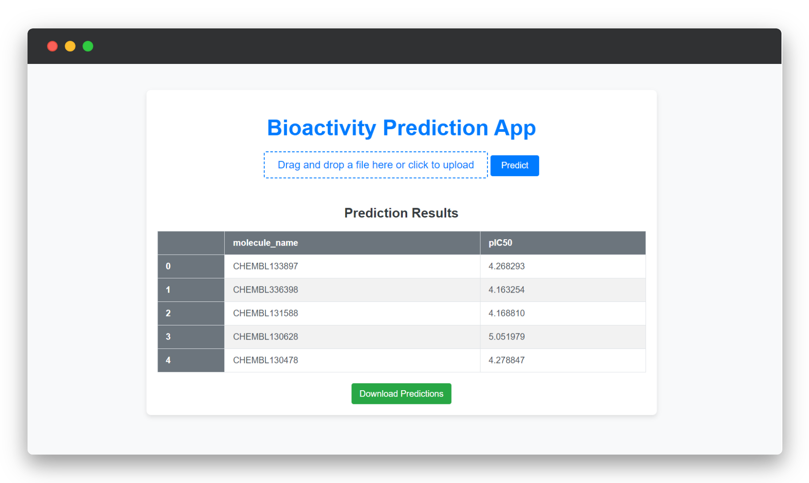

# Microsoft-Future-Ready-Talent-Virtual-Internship-Project

This is the final project created for Microsoft Future Ready Talent Virtual Internship Program

## ChEMBL Bioactivity Prediction Project

This project focuses on predicting the bioactivity of compounds against the SARS coronavirus target using data from ChEMBL (Chemical Biology Database). The goal is to develop a machine learning model that can accurately classify compounds as active, inactive, or intermediate based on their molecular properties.

## Technologies used
Python, RDKit, scikit-learn, Pandas, Numpy

### Core Azure Services
Visual Studio Code, Microsoft Azure Portal

### Azure AI Service
Azure Machine Learning

### Industry
Health

### Project Title
Bioactivity Prediction

## Utilizing Azure ML Core in the Project
This section demonstrates how Azure ML Core is integrated into different parts of the project.

### Setting Up the Azure Environment

*Azure ML Core is used to set up a machine learning workspace, create an experiment, and establish an environment for running the machine learning model*

### Deploying the Model

*The Azure ML SDK is being used to manage and deploy machine learning models within the Azure ecosystem.*

### Evaluating the Model

*The model is evaluated using a web app hosted on Azure. It accepts Canonical smiles as input and predicts the pIC50 value.*

## Setup Instructions
To set up the project environment and deploy the model, follow these steps:

1. Ensure you have Python installed on your machine.

2. Clone this repository to your local machine.

3. Install Conda if you haven't already.

4. Create a Conda environment using the provided environment.yml file:<br>
```conda env create -f environment.yml```

5. Activate the Conda environment:<br>
```conda activate <environment_name>```

6. Run the ```azure_setup.py``` script to set up the Azure environment and compute resources.

7. Run the ```prepare_data.py``` script to fetch and preprocess the bioactivity data.

8. Run the ```train.py``` script to train the predictive model.

9. Run the ```deploy_model.py``` script to register and deploy the trained model as a web service.

## Usage
1. ```prepare_data.py```: Prepares the bioactivity data by fetching, preprocessing, and computing descriptors.

2. ```train.py```: Trains the predictive model using the preprocessed data.

3. ```score.py```: Scoring script used for model inference in Azure ML deployment.

4. ```deploy_model.py```: Deploys the trained model as a web service in Azure ML.